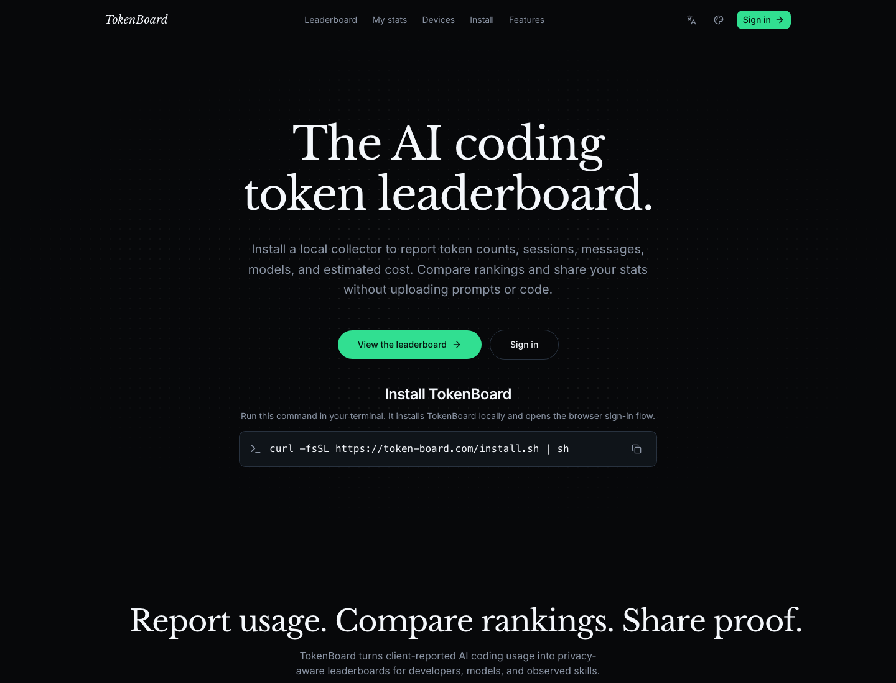

# TokenBoard

[Visit TokenBoard](https://token-board.com) ·
[Install](#install) ·
[Built with ShipAny template](https://shipany.ai/?ivt=shipany-is-good)

TokenBoard is an AI coding token leaderboard for developers who want to track,
compare, and share reported usage across AI coding assistants without uploading
prompts or code.



## Install

Run this in your terminal:

```bash
curl -fsSL https://token-board.com/install.sh | sh
```

The installer downloads the TokenBoard CLI, opens the browser login flow, links
this device to your TokenBoard account, starts a background daemon, and performs
a small first sync so your profile can show data quickly.

## What TokenBoard Shows

- User, model, and observed skill leaderboards
- Token totals, sessions, messages, and estimated cost
- Personal profile stats and activity heatmaps
- Shareable usage cards for social posts

## Privacy

TokenBoard is designed around privacy-preserving metrics. The CLI reports usage
metadata such as token counts, model names, message counts, session hashes, and
client version. It does not upload prompt text, assistant responses, command
output, code content, or full local paths.

## Supported Platforms

Current release assets:

- macOS Apple Silicon: `tokenboard-darwin-arm64`
- macOS Intel: `tokenboard-darwin-amd64`
- Linux x64: `tokenboard-linux-amd64`
- Linux ARM64: `tokenboard-linux-arm64`

The first collector supports Codex usage. More AI coding agents are planned.

## Links

- Website: https://token-board.com
- Install: [run the terminal command above](#install)
- Built with ShipAny template: https://shipany.ai/?ivt=shipany-is-good

## About This Repository

This repository hosts public binary releases for the TokenBoard CLI. The
TokenBoard source code is maintained in a separate private repository. This
repository is intentionally limited to release metadata, documentation, and
downloadable binary assets.
